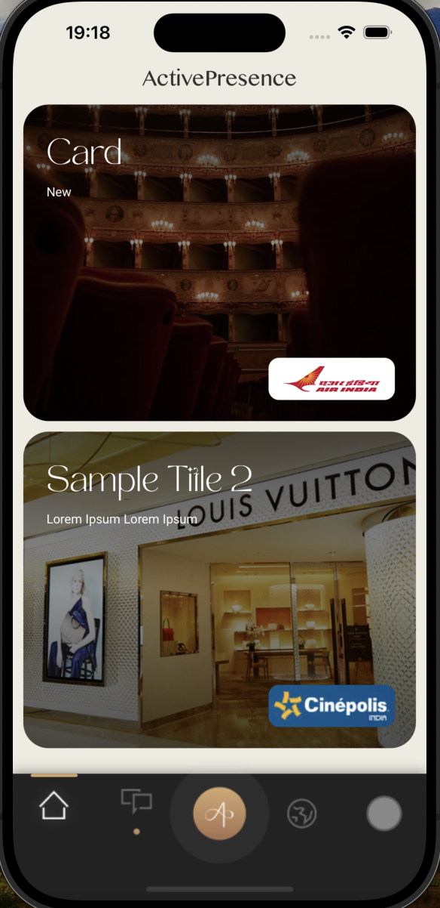

# ActivePresenceApp

Welcome to the ActivePresenceApp iOS intern candidate assignment. ActivePresenceApp is an iOS application built using Swift and UIKit. The app displays a collection of cards, each featuring various details such as titles, descriptions, and background images. Users can scroll through the cards, and the app provides fetching of card data from a remote API.

## Table of Contents

- [Features](#features)
- [Screenshots](#screenshots)
- [Requirements](#requirements)
- [Usage](#usage)

## Features

- Fetches and displays card data from an API.
- Custom card layout with background images, logos, titles, and descriptions.
- Smooth loading indicators during API data fetching.
- Error handling with user-friendly alerts.

## Screenshots

  
   
  <em>Card List Screen</em>

## Requirements

- iOS 13.0+
- Xcode 12.0+
- Swift 5.0+

## Usage

1. Launch the app.
2. The app automatically fetches card data from the server.
3. While data is loading, a loading indicator is displayed.
4. Once the data is fetched, scroll through the cards to view their details.
5. If an error occurs (e.g., network failure), an error message will be displayed with an option to retry.

